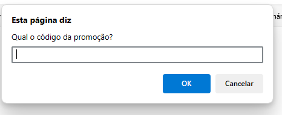
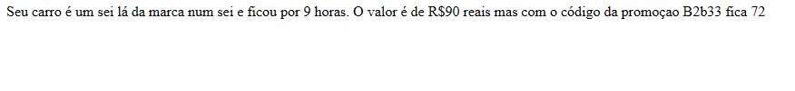

# ativJsEstacionamento
atividade de javascript de um sisteminha de estacionamento
  

  <h3>Primeiro um prompt pede as seguintes informações</h3>
  

  

  <h3>Resultado</h3>
  

  

  <h3>Esse é um dos códigos</h3>
  

  

  <h3>Os resultados dos dois códigos</h3>
    

